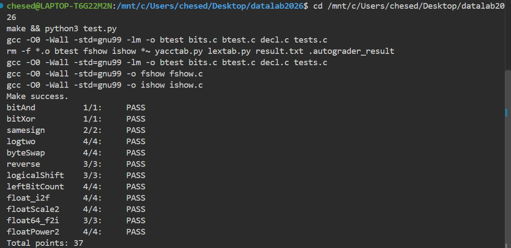

# datalab 报告

姓名：张宇生

学号：2025201709

| 总分 | bitAnd | bitXor | samesign | logtwo | byteSwap | reverse |
| --------- | --------- | --------- | --------- | --------- | --------- | --------- |
| **37.00** | 1.00 | 1.00 | 2.00 | 4.00 | 4.00 | 3.00 |

| logicalShift | leftBitCount | float_i2f | floatScale2 | float64_f2i | floatPower2 |
| --------- | --------- | --------- | --------- | --------- | --------- |
| 3.00 | 4.00 | 4.00 | 4.00 | 3.00 | 4.00 |

test 截图：



## 解题报告

### 亮点

按"限制的苛刻程度"排序，下面四个是我认为最值得说的：

1. **bitXor** —— 7 个 op 的硬上限，我做到 7 个，一个不多。
2. **logtwo** —— 题目禁用 `&`、`!`、`+`，常规写法直接写不出来，只能换思路。
3. **float64_f2i** —— 只用 16/60 op，取整靠一次移位完成，不需要循环。
4. **float_i2f** —— 完整实现了 round-to-even，包括容易漏掉的进位溢出处理。

其余函数实现都比较直接，不单独展开，统一放在最后的表格里。

### bitXor

**约束：只能用 `~` 和 `&`，上限 7 个 op —— 这是全 lab 最紧的一题。**

思路是把 XOR 按集合来读：`x & y` 是交集，`x | y` 是并集，而 XOR 要的"恰好一位是 1，不能两位都是"正好就是**并集减交集**：

```
x ^ y = (x | y) & ~(x & y)
```

到这里只剩一个障碍：`|` 不合法。用德摩根换成 `~` 和 `&`：`x | y = ~(~x & ~y)`。合并后是 7 个 op（`~x`、`~y`、`&`、`~`、`&`、`~`、`&`），恰好卡满上限。

> **先说一个我走错的路**：我最初想到的是对称拆分 `x ^ y = ~( ~(x & ~y) & ~(~x & y) )`。逻辑完全正确，但它是 **8 个 op，超限**。差别在哪：对称写法里两个半边各自都要多取一次反，而并集-交集写法里 `~(x & y)` 那个反是本来就要算的。**上限 7 不是随手写的，它恰好卡在这两条路的差额上。**

### logtwo

**约束反常：只有 `> < >> << |`。没有 `&`、没有 `!`、没有 `+`，连 `if` 都没有。**

这一条把常规写法全部堵死了——要"逐位测试 + 累加计数"，累加需要 `+`，提取某一位需要 `&`，两个都没有。能用的只剩"比较"和"移位"，于是把问题反过来问：**不问"第几位是 1"，而问"值还大于这个阈值吗"。**

思路是二分，从大到小五轮：

| 轮次 | 判断条件 | 成立则 | 权重 |
| --------- | --------- | --------- | --------- |
| 1 | `v > 0xFFFF` | `v >> 16` | 16（`<< 4`） |
| 2 | `v > 0xFF` | `v >> 8` | 8（`<< 3`） |
| 3 | `v > 0xF` | `v >> 4` | 4（`<< 2`） |
| 4 | `v > 0x3` | `v >> 2` | 2（`<< 1`） |
| 5 | `v > 1` | —— | 1 |

有一个我觉得比较巧的地方：`(v > 0xFFFF)` 的结果是 0 或 1，而需要的权重是 0 或 16，**用 `<< 4` 就能从布尔值直接算出权重**。这样同一个值既当"要不要移位"的开关，又当"计几分"的权重，不需要 `if`，也不需要第二个变量。

一共 18 个 op，离上限 25 还有余量。

> **踩过的坑**：我一开始写的是 `int t = v & 0xFFFF;` 先把低半段取出来再判断，写完了才发现 `&` 不在合法符号表里。改成"直接拿阈值常量比较"之后，不但合法了，op 数还从 23 降到 18——因为不再需要中间变量和额外的移位。

### leftBitCount

**要求数左侧连续 1 的个数。上限 50，比较宽松。**

先做一次等价变换降低难度：**数 `x` 的左侧连续 1，等价于数 `~x` 的前导零。** 这样就变成了标准的"找第一个 0 的位置"问题。

然后二分定位，依次试 16、8、4、2、1 这些步长：

```c
t = !(y >> 16);        /* 高 16 位全是 0 吗？ */
c = c + (t << 4);      /* 是的话，答案至少 16 */
y = y << (t << 4);     /* 是的话整体左移，问题缩小到后半段 */
```

和 `logtwo` 是同一个技巧：**`t` 同时充当"计数权重"和"移位量"**，所以每一轮只需要 5 个 op。五轮一共 31 op，离上限 50 还有富余。

**最后一步 `c = c + !y` 是这道题唯一需要专门想的地方。** 五轮的权重加起来只有 16+8+4+2+1 = 31，而答案可能是 32——这种情况只在 `x = -1`（`y` 全零）时出现。由于 `y` 只做左移，它变成 0 的唯一可能就是本来是 0，所以 `!y` 恰好能补上这一位，且不会误伤其他情况。

我专门单点验证过三个边界：`leftBitCount(-1) = 32`、`leftBitCount(0x80000000) = 1`、`leftBitCount(0) = 0`。

### float_i2f

**把 int 按位转成单精度浮点。难点不在取位，在舍入。**

流程四步：特判 0 → 拆出符号、取绝对值 → **左移归一化**（循环把最高位 1 推到 bit31，移位次数 `e` 就是指数信息）→ 取 23 位尾数并舍入。

舍入按 **round-to-even**（向偶数舍入）分三种情况处理被丢弃的 8 位 `rnd`：

- `rnd > 0x80` —— 超过一半，直接进位
- `rnd == 0x80` —— **正好一半，看尾数末位的奇偶**：末位是奇数才进位，这样结果永远是偶数
- `rnd < 0x80` —— 不到一半，舍去

**最容易漏的是进位溢出**：尾数加 1 之后可能变成 `0x800000`，这已经越过了隐含位，必须把尾数清回 0、同时把指数减 1。少写这一步，只有极少数输入会错，很难靠随手测发现。

验证时我特意选了卡在正中间的输入：`0x01000001`（舍去）、`0x01000003`（进位），以及 `INT_MIN`（取绝对值会溢出，得注意用 `-x` 还是转 `unsigned`）。

### 其余函数一览

| 函数 | 分数 | op / 上限 | 思路 |
| --------- | --------- | --------- | --------- |
| bitAnd | 1.00 | 4 / 7 | 德摩根：`~(~x \| ~y)` |
| samesign | 2.00 | 9 / 12 | 符号有**三类**（负/零/正），`x >> 31` 只有两档，得先用 `!x` 把零拆出来单独判 |
| byteSwap | 4.00 | 15 / 17 | 取出两个字节 → 合并掩码清零这两个位置 → 交叉回填 |
| reverse | 3.00 | 5 / 30 | 循环 32 次逐位移出；op 按代码里的节点数计，循环体只算一次 |
| logicalShift | 3.00 | 6 / 20 | 先算术右移，再用掩码 `~((~0x7FFFFFFF >> n) << 1)` 清掉被符号扩展的高位 |
| floatScale2 | 4.00 | 10 / 30 | 按阶码分四种情形：Inf·NaN 原样返回、非规格化尾数左移、指数溢出成 Inf、正常指数加 1 |
| float64_f2i | 3.00 | 16 / 60 | 拼出尾数高 32 位后，取整只需要 `h >> (31 - e)` 一次移位就完成截断（向零取整） |
| floatPower2 | 4.00 | 9 / 30 | 三段判断：上溢返回 +Inf、规格化 `(x+127) << 23`、非规格化 `1 << (x+149)`、下溢返回 0 |

## 反馈/收获/感悟/总结

<!-- 这一节请用你自己的话写。可以参考：花了多少时间？哪题最费劲？哪题最有意思？200 字以内，也可以不写。 -->

## 参考的重要资料

<!-- 对你实现有启发或直接引用的文章/课本/PPT，请列出标题和可访问的链接。没有可留空。 -->
